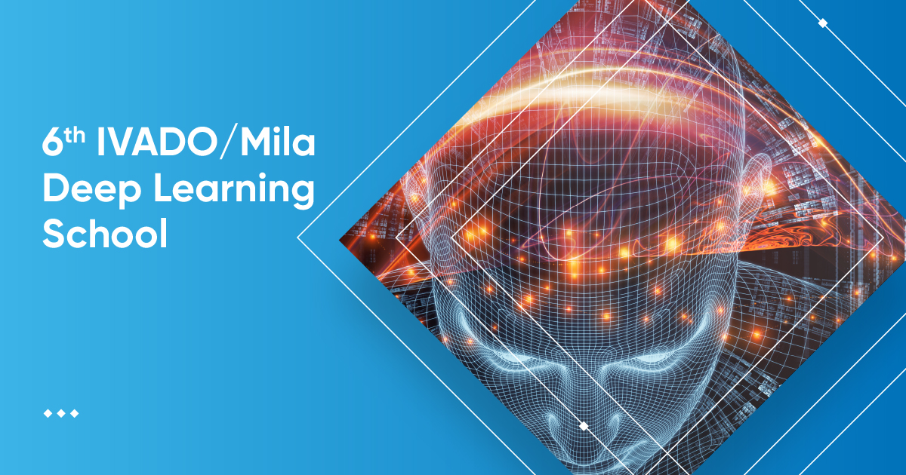

# IVADO/Mila's Deep Learning school, 6th edition (Online) - March 25th to April 29th 2021

## Welcome!

Welcome to the IVADO/Mila Deep Learning school! This 6th edition is given online for the first time and is hosted on the [Swapcard platform](https://www.swapcard.com/).

In this repo, you will find all the material needed for completing the [tutorials](tutorials) of the school as well as the [slides](slides) presenting updates that complement the [MOOC](https://cours.edulib.org/courses/course-v1:UMontreal+IVADO-DL1EN+A2020/about).

## Course Structure

All lectures are given virtually. Each lecture presents new material and assumes you have completed the appropriate module on the [MOOC](https://cours.edulib.org/courses/course-v1:UMontreal+IVADO-DL1EN+A2020/about). Lectures from weeks 1 to 4 are followed by tutorials that will help you practice some of the most relevant concepts.

Each [tutorials](tutorials) has two files associated with it:
* The `_to_complete` file in which templates are provided but code is left out for you to complete.
* The `_solutions` file includes suggested solutions. _Note: That file will be uploaded after each respective live coding session._

## Practical Information

The tutorials are in [Jupyter Notebook](http://jupyter.org) format. To facilitate usage/setup of those notebooks, we will be using [Google Colab](https://colab.research.google.com/github/mila-iqia/ivado-mila-dl-school-2021) which gives users access to a pre-configured python environment with all the necessary dependencies. It also gives access to free GPUs for cloud computation. Using Colab will require an internet connection and a Google Account. You can use the notebooks locally if you so choose. However, an additional setup will be necessary.

## [Tutorials on Colab](https://colab.research.google.com/github/mila-iqia/ivado-mila-dl-school-2021/)

## Additional information

For more information about the deep learning school, visit the [official website.](https://ivado.ca/en/events/6th-ivado-mila-deep-learning-school)

For more information about [Mila](https://mila.quebec) or [IVADO](https://ivado.ca), visit the official websites.
